# UCI BootCamp Project 3

# ACCTG Web Accounting

## DEMO on Heroku [here](https://peaceful-anchorage-98434.herokuapp.com/)

## Github [here](https://github.com/stevenguy/bc-project-3)

## Description:
A simple enterprise accounting/book-keeping web-based application where the user can do the following:

1. Login and different user roles
2. User Dashboard
3. Upload a CSV file into the database
4. Book a Journal Entry
5. Run financial statement reports
6. Approved/Unapproved Journal Entries
7. Search Journal Entries

The Application is completely mobile responsive. Desktop and mobile screenshots below @ each functionality description.

## Technology
1. MongoDB/Mongoose
2. Express
3. ReactJS
4. NodeJS
5. Firebase Authentication
6. Material Ui

## API Routes
1. Create
  * Create via Functionality #3
  * Create via Functionality #4
2. Read:
  * Create via Functionality #5
  * Create via Functionality #6
  * Create via Functionality #7
3. Update
  * Create via Functionality #6
  * Create via Functionality #7
4. Delete
  * Create via Functionality #4
5. User signin
6. User ID

## Website’s Appearance
1. Home/Login Page:  Dark color scheme (Red and Black)
2. Dashboard, etc: Light color scheme (White background, light grey top menu, and dark grey side menu)
3. Design: Clean, minimalist, and simple
  * A child should be able to navigate through it
  * Emphasis card usage
4. Pictures: No pictures except on the login page and homepage
5. CSS framework = Material UI

## Functionality Assignment
1. Login and different user roles coded by [Thomas Nguyen](https://github.com/tealeafnguyen)
2. User Dashboard coded by [Jon Song](https://github.com/jonsong246)
3. Upload a CSV file into the database coded by [Bunrith Buth](https://github.com/bunrithbuth)
4. Book a Journal Entry coded by [Mearat Hou](https://github.com/mearatjames)
5. Run financial statement reports coded by [Steve Nguy](https://github.com/stevenguy)
6. Approved/Pending/Unapproved Journal Entries coded by [Ben Oh](https://github.com/b3n0h)
7. Search Journal Entries coded by [Jin Choi](https://github.com/jchoi166)

## Each team member was responsible for coding their assigned functionality with ReactJS and writing their own API routes for their functionality.

## Functionalities 

### 1. Login & Different User Roles [Thomas Nguyen](https://github.com/tealeafnguyen)

Users have a login page and each user will have assigned “roles”.  The user will be assigned as 'Preparer' upon registering and the Admin will change their roles. In addition, users have the ability to login with Google via Firebase Authentication. 

#### Desktop View
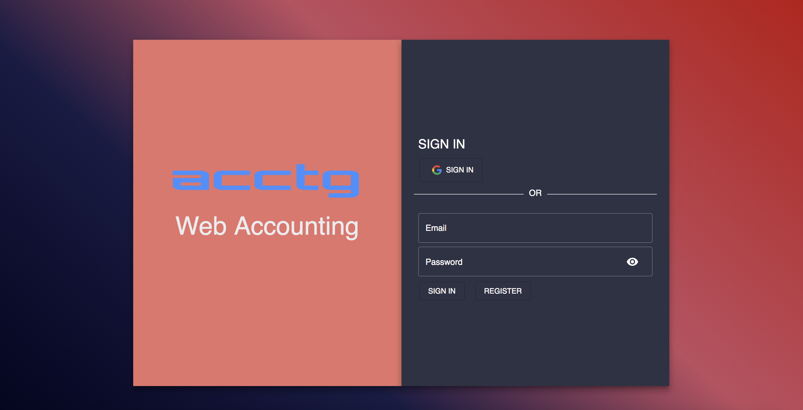

#### Mobile View
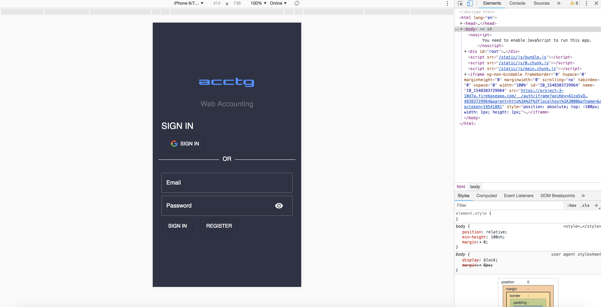

#### Roles

##### PREPARER: 
1. Lowest authority
2. The person who prepares and initiates the Journal Entry

##### MANAGER: 
1. Middle authority
2. The approver will be the person who approves the Preparer’s journal entry

##### ADMIN
1. Highest Authority
2. Assigns roles to users

#### Desktop View
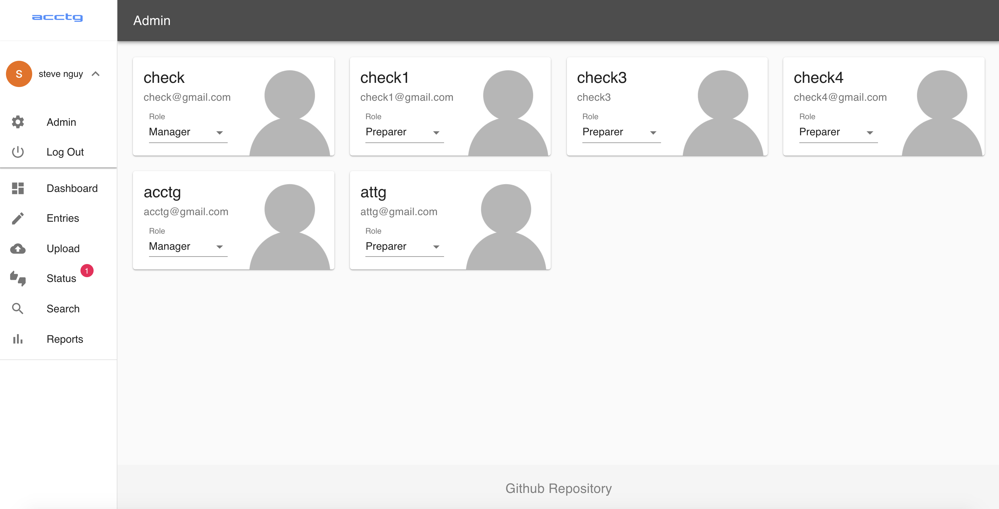

#### Mobile View
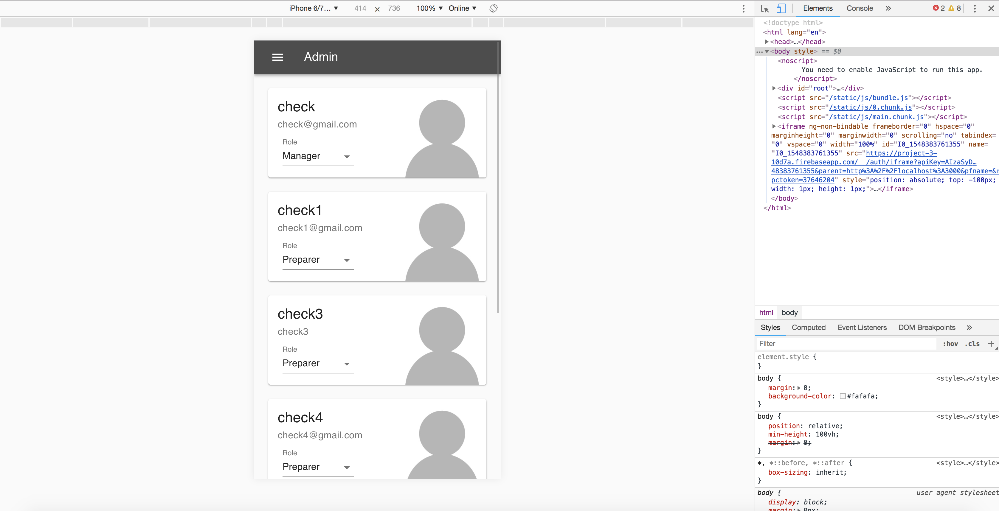


### 2. Dashboard [Jon Song](https://github.com/jonsong246)

Dashboard will consist of four cards and each card will route to its respective page:
1. Approved/Unapproved Journal Entries
2. Search Journal Entries
3. Run Reports
4. Upload Transactions
5. Revenue & Expense Graph

#### Desktop View
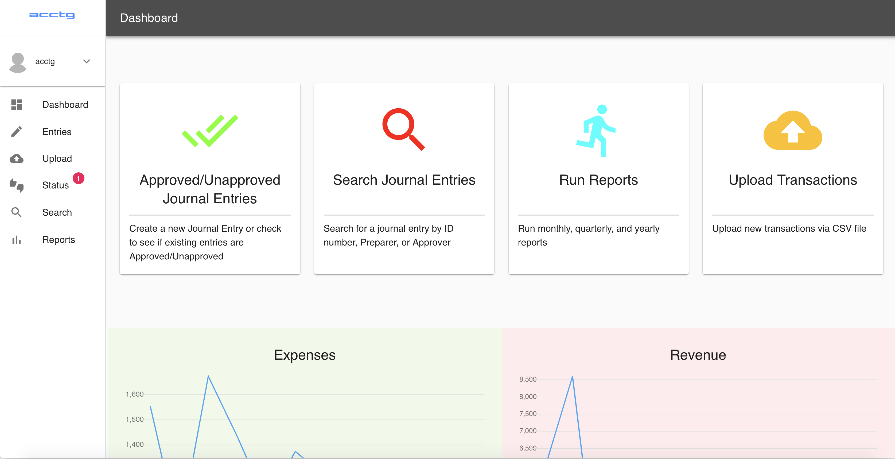

#### Mobile View
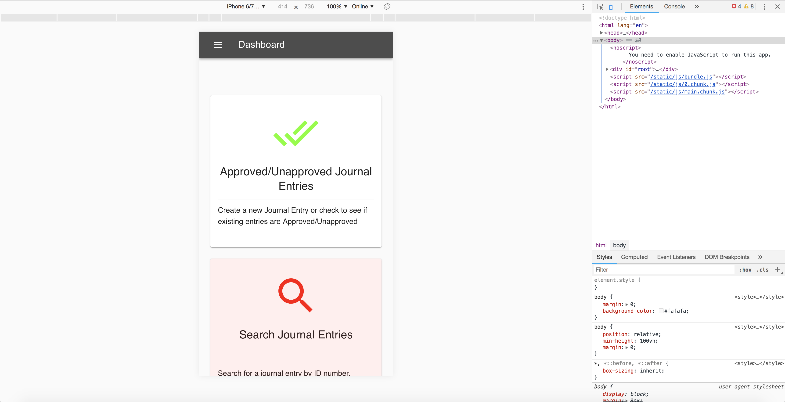

### 3. CSV Upload [Bunrith Buth](https://github.com/bunrithbuth)

Upload a CSV file into the database
1. User have the ability to bulk upload journal entries via a CSV template file.
2. The upload will automatically map the fields for the user and the user has the ability to change the fields.

#### Desktop View
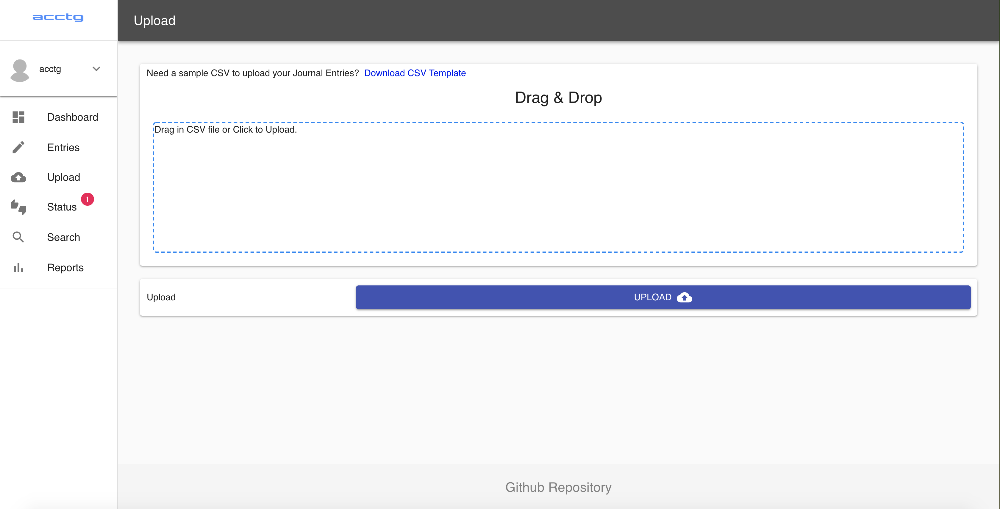

#### Mobile View
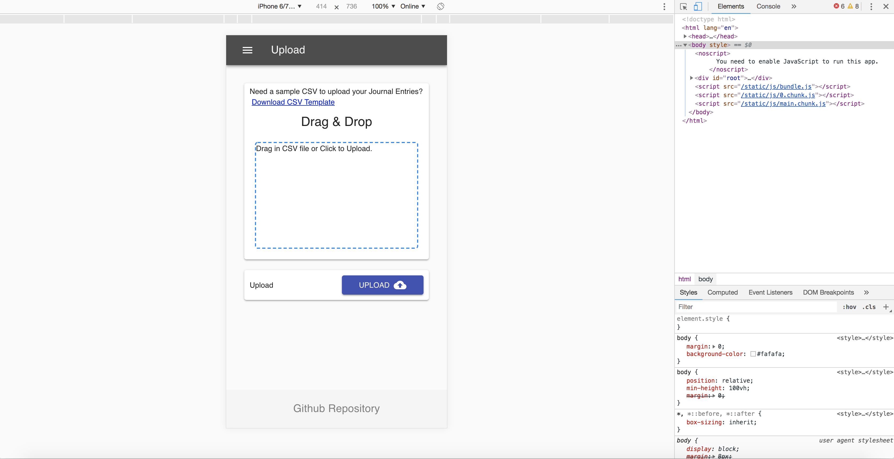

### 4. Booking Journal Entry [Mearat Hou](https://github.com/mearatjames)

User will have the ability to book a journal entry manually and create new accounts 

1. Book a single or multiple Journal Entry transactions
2. Based pre-defined accounts and customize accounts
3. Journal Entries will have the following input fields

#### Desktop View
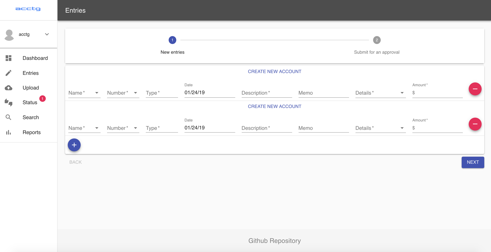

#### Mobile View
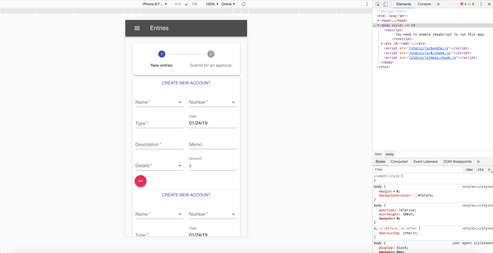

### 5. Run Financial Statement Reports [Steve Nguy](https://github.com/stevenguy)

The user will be able to run financial statement reports regardless of user roles
1. Reports will be populated on 'Approved' journal entries only. 
2. Reports include Income Statement, Balance Sheet, Account Details, Comparative Income Statement (e.g., August 2018 vs Sept 2018, Q1 vs Q2, and 2018 vs 2019) and Comparative Balance Sheet (e.g., August 2018 vs Sept 2018, Q1 vs Q2, and 2018 vs 2019) 
3. Users can run yearly, quarterly, and monthly reports

#### Desktop View
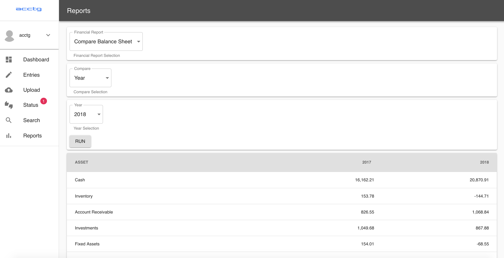

#### Mobile View
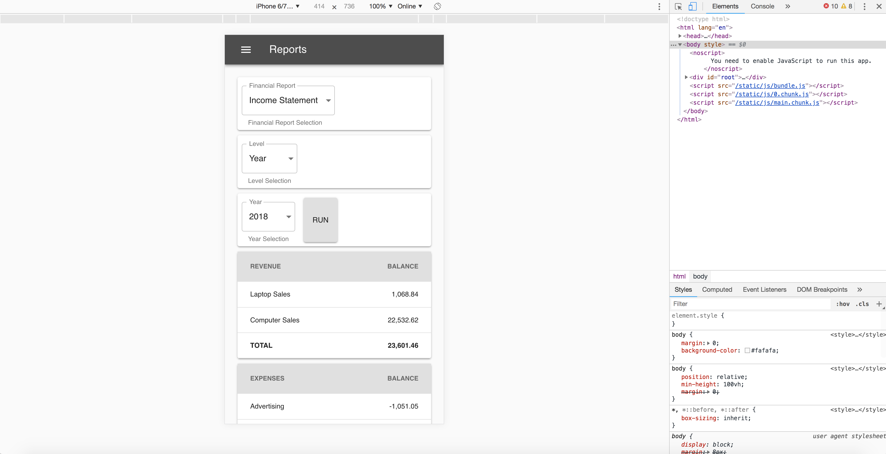

### 6. Approved/Pending/Unapproved Journal Entries [Ben Oh](https://github.com/b3n0h)

The Status page will give the user the ability to quickly find the status of Journal Entries based on Approved, Pending, and Unapproved status.  In addition, a user with a Manager role will be able to Approved and Unapproved Journal Entries.

#### Desktop View
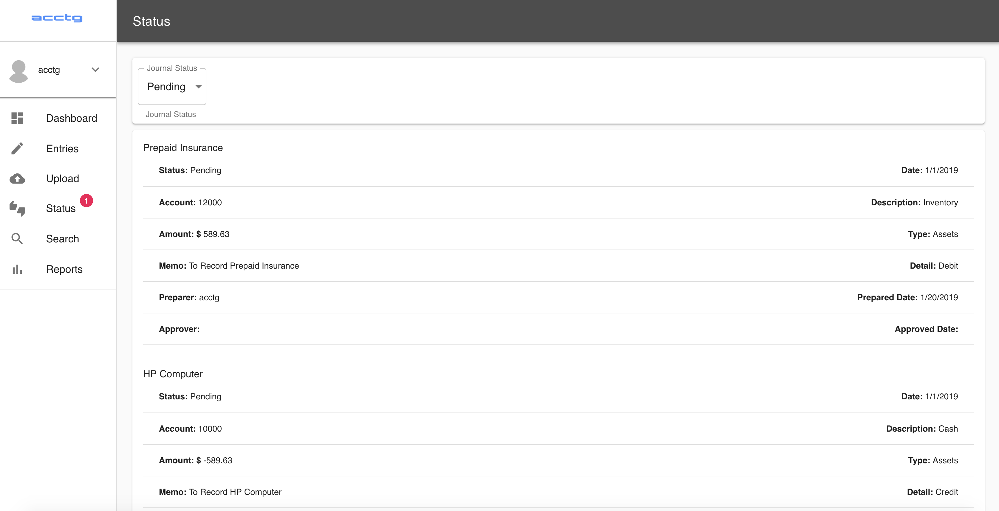

#### Mobile View
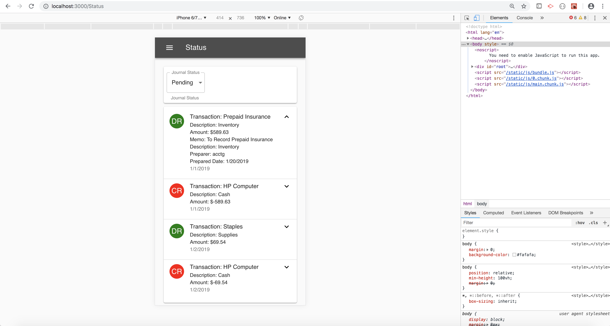

### 7. Search Journal Entries [Jin Choi](https://github.com/jchoi166)

Users can search for specific Journal Entries via the Journal ID.  In addition, they have the ability to search Journal Entries by Preparer or Approver. The manager has the ability to Approved and Unapproved Journal Entries. Each search option has an auto-fill feature to help users find data quickly. 

#### Desktop View
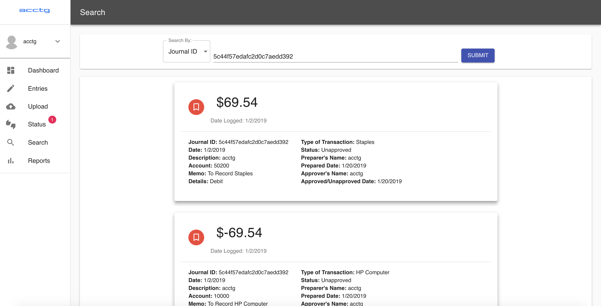

#### Mobile View
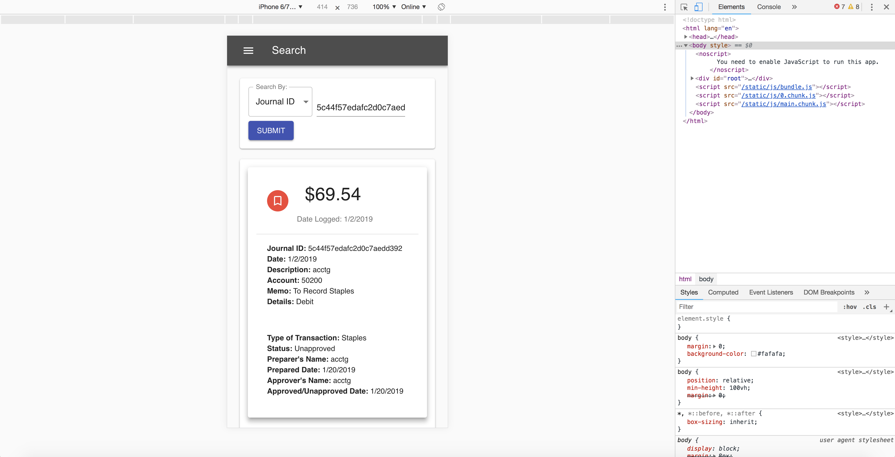